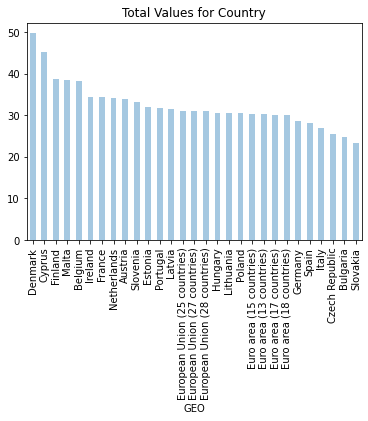
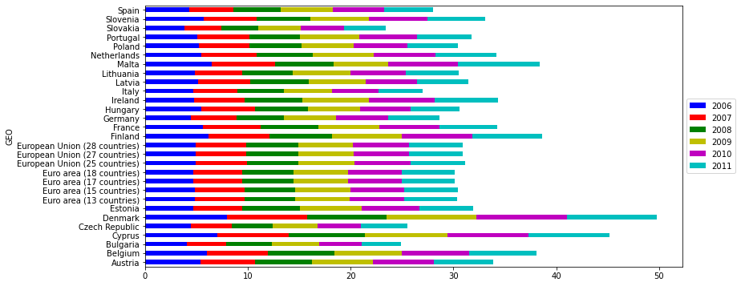

Tarea Base de Datos - Saúl Maldonado Navarro
Jupyter y Pandas


```python
import pandas as pd
import numpy as np
import matplotlib.pyplot as plt
```

*Para comprobar que las bibliotecas se han importado correctamente compilaremos el siguiente ejemplo:*


```python
data = { 'year': [2010, 2011, 2012, 2010, 2011, 2012, 2010, 2011, 2012], 
        'team': ['FCBarcelona', 'FCBarcelona', 'FCBarcelona', 'RMadrid', 
                    'RMadrid', 'RMadrid', 'ValenciaCF', 'ValenciaCF', 'ValenciaCF'], 
                    'wins': [30, 28, 32, 29, 32, 26, 21, 17, 19], 'draws': [6, 7, 4, 5, 4, 7, 8, 10, 8], 
                    'losses': [2, 3, 2, 4, 2, 5, 9, 11, 11] }

football = pd.DataFrame(data, columns = ['year', 'team', 'wins', 'draws', 'losses'])
```


```python
football
```


<div>
<style scoped>
    .dataframe tbody tr th:only-of-type {
        vertical-align: middle;
    }

    .dataframe tbody tr th {
        vertical-align: top;
    }

    .dataframe thead th {
        text-align: right;
    }
</style>
<table border="1" class="dataframe">
  <thead>
    <tr style="text-align: right;">
      <th></th>
      <th>year</th>
      <th>team</th>
      <th>wins</th>
      <th>draws</th>
      <th>losses</th>
    </tr>
  </thead>
  <tbody>
    <tr>
      <th>0</th>
      <td>2010</td>
      <td>FCBarcelona</td>
      <td>30</td>
      <td>6</td>
      <td>2</td>
    </tr>
    <tr>
      <th>1</th>
      <td>2011</td>
      <td>FCBarcelona</td>
      <td>28</td>
      <td>7</td>
      <td>3</td>
    </tr>
    <tr>
      <th>2</th>
      <td>2012</td>
      <td>FCBarcelona</td>
      <td>32</td>
      <td>4</td>
      <td>2</td>
    </tr>
    <tr>
      <th>3</th>
      <td>2010</td>
      <td>RMadrid</td>
      <td>29</td>
      <td>5</td>
      <td>4</td>
    </tr>
    <tr>
      <th>4</th>
      <td>2011</td>
      <td>RMadrid</td>
      <td>32</td>
      <td>4</td>
      <td>2</td>
    </tr>
    <tr>
      <th>5</th>
      <td>2012</td>
      <td>RMadrid</td>
      <td>26</td>
      <td>7</td>
      <td>5</td>
    </tr>
    <tr>
      <th>6</th>
      <td>2010</td>
      <td>ValenciaCF</td>
      <td>21</td>
      <td>8</td>
      <td>9</td>
    </tr>
    <tr>
      <th>7</th>
      <td>2011</td>
      <td>ValenciaCF</td>
      <td>17</td>
      <td>10</td>
      <td>11</td>
    </tr>
    <tr>
      <th>8</th>
      <td>2012</td>
      <td>ValenciaCF</td>
      <td>19</td>
      <td>8</td>
      <td>11</td>
    </tr>
  </tbody>
</table>
</div>


Una vez que vimos que todo ha corrido correctamente, procedemos a correr ejercicios basados en una Base de Datos tomada de 
datos estadísticos de Europa.

Una vez obtenidos los datos, guardamos el archivo .csv en la misma carpeta que el proyecto y procedemosa leer los datos:

1. Leectura de datos


```python
#Reading Data
edu = pd.read_csv('educ_figdp_1_Data.csv',na_values=':', usecols=['TIME', 'GEO', 'Value'])
```


```python
edu
```


<div>
<style scoped>
    .dataframe tbody tr th:only-of-type {
        vertical-align: middle;
    }

    .dataframe tbody tr th {
        vertical-align: top;
    }

    .dataframe thead th {
        text-align: right;
    }
</style>
<table border="1" class="dataframe">
  <thead>
    <tr style="text-align: right;">
      <th></th>
      <th>TIME</th>
      <th>GEO</th>
      <th>Value</th>
    </tr>
  </thead>
  <tbody>
    <tr>
      <th>0</th>
      <td>2000</td>
      <td>European Union (28 countries)</td>
      <td>NaN</td>
    </tr>
    <tr>
      <th>1</th>
      <td>2001</td>
      <td>European Union (28 countries)</td>
      <td>NaN</td>
    </tr>
    <tr>
      <th>2</th>
      <td>2002</td>
      <td>European Union (28 countries)</td>
      <td>5.00</td>
    </tr>
    <tr>
      <th>3</th>
      <td>2003</td>
      <td>European Union (28 countries)</td>
      <td>5.03</td>
    </tr>
    <tr>
      <th>4</th>
      <td>2004</td>
      <td>European Union (28 countries)</td>
      <td>4.95</td>
    </tr>
    <tr>
      <th>...</th>
      <td>...</td>
      <td>...</td>
      <td>...</td>
    </tr>
    <tr>
      <th>379</th>
      <td>2007</td>
      <td>Finland</td>
      <td>5.90</td>
    </tr>
    <tr>
      <th>380</th>
      <td>2008</td>
      <td>Finland</td>
      <td>6.10</td>
    </tr>
    <tr>
      <th>381</th>
      <td>2009</td>
      <td>Finland</td>
      <td>6.81</td>
    </tr>
    <tr>
      <th>382</th>
      <td>2010</td>
      <td>Finland</td>
      <td>6.85</td>
    </tr>
    <tr>
      <th>383</th>
      <td>2011</td>
      <td>Finland</td>
      <td>6.76</td>
    </tr>
  </tbody>
</table>
<p>384 rows × 3 columns</p>
</div>


Ahora, tenemos el metétodo: head()


```python
edu.head(6)
```


<div>
<style scoped>
    .dataframe tbody tr th:only-of-type {
        vertical-align: middle;
    }

    .dataframe tbody tr th {
        vertical-align: top;
    }

    .dataframe thead th {
        text-align: right;
    }
</style>
<table border="1" class="dataframe">
  <thead>
    <tr style="text-align: right;">
      <th></th>
      <th>TIME</th>
      <th>GEO</th>
      <th>Value</th>
    </tr>
  </thead>
  <tbody>
    <tr>
      <th>0</th>
      <td>2000</td>
      <td>European Union (28 countries)</td>
      <td>NaN</td>
    </tr>
    <tr>
      <th>1</th>
      <td>2001</td>
      <td>European Union (28 countries)</td>
      <td>NaN</td>
    </tr>
    <tr>
      <th>2</th>
      <td>2002</td>
      <td>European Union (28 countries)</td>
      <td>5.00</td>
    </tr>
    <tr>
      <th>3</th>
      <td>2003</td>
      <td>European Union (28 countries)</td>
      <td>5.03</td>
    </tr>
    <tr>
      <th>4</th>
      <td>2004</td>
      <td>European Union (28 countries)</td>
      <td>4.95</td>
    </tr>
    <tr>
      <th>5</th>
      <td>2005</td>
      <td>European Union (28 countries)</td>
      <td>4.92</td>
    </tr>
  </tbody>
</table>
</div>


Como podemos ver, indicamos en su argumento el numero filas a mostrar

De misma manera, tenemos el metodo: tail(), que en su argumeto esta vez nos mostrará las últimas filas de la base de datos.


```python
edu.tail(6)
```


<div>
<style scoped>
    .dataframe tbody tr th:only-of-type {
        vertical-align: middle;
    }

    .dataframe tbody tr th {
        vertical-align: top;
    }

    .dataframe thead th {
        text-align: right;
    }
</style>
<table border="1" class="dataframe">
  <thead>
    <tr style="text-align: right;">
      <th></th>
      <th>TIME</th>
      <th>GEO</th>
      <th>Value</th>
    </tr>
  </thead>
  <tbody>
    <tr>
      <th>378</th>
      <td>2006</td>
      <td>Finland</td>
      <td>6.18</td>
    </tr>
    <tr>
      <th>379</th>
      <td>2007</td>
      <td>Finland</td>
      <td>5.90</td>
    </tr>
    <tr>
      <th>380</th>
      <td>2008</td>
      <td>Finland</td>
      <td>6.10</td>
    </tr>
    <tr>
      <th>381</th>
      <td>2009</td>
      <td>Finland</td>
      <td>6.81</td>
    </tr>
    <tr>
      <th>382</th>
      <td>2010</td>
      <td>Finland</td>
      <td>6.85</td>
    </tr>
    <tr>
      <th>383</th>
      <td>2011</td>
      <td>Finland</td>
      <td>6.76</td>
    </tr>
  </tbody>
</table>
</div>


El metodo describe() que nos muestra ciertos puntos estadísticos de la base de datos. 


```python
edu.describe()
```


<div>
<style scoped>
    .dataframe tbody tr th:only-of-type {
        vertical-align: middle;
    }

    .dataframe tbody tr th {
        vertical-align: top;
    }

    .dataframe thead th {
        text-align: right;
    }
</style>
<table border="1" class="dataframe">
  <thead>
    <tr style="text-align: right;">
      <th></th>
      <th>TIME</th>
      <th>Value</th>
    </tr>
  </thead>
  <tbody>
    <tr>
      <th>count</th>
      <td>384.000000</td>
      <td>361.000000</td>
    </tr>
    <tr>
      <th>mean</th>
      <td>2005.500000</td>
      <td>5.203989</td>
    </tr>
    <tr>
      <th>std</th>
      <td>3.456556</td>
      <td>1.021694</td>
    </tr>
    <tr>
      <th>min</th>
      <td>2000.000000</td>
      <td>2.880000</td>
    </tr>
    <tr>
      <th>25%</th>
      <td>2002.750000</td>
      <td>4.620000</td>
    </tr>
    <tr>
      <th>50%</th>
      <td>2005.500000</td>
      <td>5.060000</td>
    </tr>
    <tr>
      <th>75%</th>
      <td>2008.250000</td>
      <td>5.660000</td>
    </tr>
    <tr>
      <th>max</th>
      <td>2011.000000</td>
      <td>8.810000</td>
    </tr>
  </tbody>
</table>
</div>


2. Seleccion de datos

Si queremos indicar solo un subconjunto de nustra base de datos, usaremos [] para indicar el subconjunto


```python
edu['TIME']
```


    0      2000
    1      2001
    2      2002
    3      2003
    4      2004
           ... 
    379    2007
    380    2008
    381    2009
    382    2010
    383    2011
    Name: TIME, Length: 384, dtype: int64


Ahora, si queremos seleccionar un rango de filas, usaremos [] y los numeros separados por ","


```python
edu[10:14]
```


<div>
<style scoped>
    .dataframe tbody tr th:only-of-type {
        vertical-align: middle;
    }

    .dataframe tbody tr th {
        vertical-align: top;
    }

    .dataframe thead th {
        text-align: right;
    }
</style>
<table border="1" class="dataframe">
  <thead>
    <tr style="text-align: right;">
      <th></th>
      <th>TIME</th>
      <th>GEO</th>
      <th>Value</th>
    </tr>
  </thead>
  <tbody>
    <tr>
      <th>10</th>
      <td>2010</td>
      <td>European Union (28 countries)</td>
      <td>5.41</td>
    </tr>
    <tr>
      <th>11</th>
      <td>2011</td>
      <td>European Union (28 countries)</td>
      <td>5.25</td>
    </tr>
    <tr>
      <th>12</th>
      <td>2000</td>
      <td>European Union (27 countries)</td>
      <td>4.91</td>
    </tr>
    <tr>
      <th>13</th>
      <td>2001</td>
      <td>European Union (27 countries)</td>
      <td>4.99</td>
    </tr>
  </tbody>
</table>
</div>


Si queremos acceder a un subconjunto de filas y columnas de una etiqueta o etiquetas en particular, lo indicaremos
de la siguiente forma: 


```python
edu.iloc[10:20][['TIME','GEO']]
```


<div>
<style scoped>
    .dataframe tbody tr th:only-of-type {
        vertical-align: middle;
    }

    .dataframe tbody tr th {
        vertical-align: top;
    }

    .dataframe thead th {
        text-align: right;
    }
</style>
<table border="1" class="dataframe">
  <thead>
    <tr style="text-align: right;">
      <th></th>
      <th>TIME</th>
      <th>GEO</th>
    </tr>
  </thead>
  <tbody>
    <tr>
      <th>10</th>
      <td>2010</td>
      <td>European Union (28 countries)</td>
    </tr>
    <tr>
      <th>11</th>
      <td>2011</td>
      <td>European Union (28 countries)</td>
    </tr>
    <tr>
      <th>12</th>
      <td>2000</td>
      <td>European Union (27 countries)</td>
    </tr>
    <tr>
      <th>13</th>
      <td>2001</td>
      <td>European Union (27 countries)</td>
    </tr>
    <tr>
      <th>14</th>
      <td>2002</td>
      <td>European Union (27 countries)</td>
    </tr>
    <tr>
      <th>15</th>
      <td>2003</td>
      <td>European Union (27 countries)</td>
    </tr>
    <tr>
      <th>16</th>
      <td>2004</td>
      <td>European Union (27 countries)</td>
    </tr>
    <tr>
      <th>17</th>
      <td>2005</td>
      <td>European Union (27 countries)</td>
    </tr>
    <tr>
      <th>18</th>
      <td>2006</td>
      <td>European Union (27 countries)</td>
    </tr>
    <tr>
      <th>19</th>
      <td>2007</td>
      <td>European Union (27 countries)</td>
    </tr>
  </tbody>
</table>
</div>


3. Filtrar datos

Otra forma de abtener datos, es aplicando una idexación boolena, donde vamos a poder filtrar datos audandonos de operaciónes 
booleanas.


```python
edu[edu['Value'] > 4].tail()
```


<div>
<style scoped>
    .dataframe tbody tr th:only-of-type {
        vertical-align: middle;
    }

    .dataframe tbody tr th {
        vertical-align: top;
    }

    .dataframe thead th {
        text-align: right;
    }
</style>
<table border="1" class="dataframe">
  <thead>
    <tr style="text-align: right;">
      <th></th>
      <th>TIME</th>
      <th>GEO</th>
      <th>Value</th>
    </tr>
  </thead>
  <tbody>
    <tr>
      <th>379</th>
      <td>2007</td>
      <td>Finland</td>
      <td>5.90</td>
    </tr>
    <tr>
      <th>380</th>
      <td>2008</td>
      <td>Finland</td>
      <td>6.10</td>
    </tr>
    <tr>
      <th>381</th>
      <td>2009</td>
      <td>Finland</td>
      <td>6.81</td>
    </tr>
    <tr>
      <th>382</th>
      <td>2010</td>
      <td>Finland</td>
      <td>6.85</td>
    </tr>
    <tr>
      <th>383</th>
      <td>2011</td>
      <td>Finland</td>
      <td>6.76</td>
    </tr>
  </tbody>
</table>
</div>


4. Filtrar valores faltantes

En Pandas, existe un valor especial. NaN, que en ingles significa not a number, el cual se usa cuando se neesita de
un resultado con valor indefinido.


```python
edu[edu["Value"].isnull()].head()
```


<div>
<style scoped>
    .dataframe tbody tr th:only-of-type {
        vertical-align: middle;
    }

    .dataframe tbody tr th {
        vertical-align: top;
    }

    .dataframe thead th {
        text-align: right;
    }
</style>
<table border="1" class="dataframe">
  <thead>
    <tr style="text-align: right;">
      <th></th>
      <th>TIME</th>
      <th>GEO</th>
      <th>Value</th>
    </tr>
  </thead>
  <tbody>
    <tr>
      <th>0</th>
      <td>2000</td>
      <td>European Union (28 countries)</td>
      <td>NaN</td>
    </tr>
    <tr>
      <th>1</th>
      <td>2001</td>
      <td>European Union (28 countries)</td>
      <td>NaN</td>
    </tr>
    <tr>
      <th>36</th>
      <td>2000</td>
      <td>Euro area (18 countries)</td>
      <td>NaN</td>
    </tr>
    <tr>
      <th>37</th>
      <td>2001</td>
      <td>Euro area (18 countries)</td>
      <td>NaN</td>
    </tr>
    <tr>
      <th>48</th>
      <td>2000</td>
      <td>Euro area (17 countries)</td>
      <td>NaN</td>
    </tr>
  </tbody>
</table>
</div>


5. Manipular datos

Ahora, veremos algunas funciones utiles en Pandas para la manipuacion de datos


```python
edu.max(axis = 0)
```


    TIME      2011
    GEO      Spain
    Value     8.81
    dtype: object


```python
print ('Pandas max function:', edu['Value'].max())
print ('Python max function:', max(edu['Value']))

```

    Pandas max function: 8.81
    Python max function: nan
    


```python
s = edu["Value"]/100
s.head()
```


    0       NaN
    1       NaN
    2    0.0500
    3    0.0503
    4    0.0495
    Name: Value, dtype: float64


```python
s = edu["Value"].apply(np.sqrt)
s.head()
```


    0         NaN
    1         NaN
    2    2.236068
    3    2.242766
    4    2.224860
    Name: Value, dtype: float64


```python
s = edu["Value"].apply(lambda d: d**2)
s.head()
```


    0        NaN
    1        NaN
    2    25.0000
    3    25.3009
    4    24.5025
    Name: Value, dtype: float64


```python
edu['ValueNorm'] = edu['Value']/edu['Value'].max()
edu.tail()
```


<div>
<style scoped>
    .dataframe tbody tr th:only-of-type {
        vertical-align: middle;
    }

    .dataframe tbody tr th {
        vertical-align: top;
    }

    .dataframe thead th {
        text-align: right;
    }
</style>
<table border="1" class="dataframe">
  <thead>
    <tr style="text-align: right;">
      <th></th>
      <th>TIME</th>
      <th>GEO</th>
      <th>Value</th>
      <th>ValueNorm</th>
    </tr>
  </thead>
  <tbody>
    <tr>
      <th>379</th>
      <td>2007</td>
      <td>Finland</td>
      <td>5.90</td>
      <td>0.669694</td>
    </tr>
    <tr>
      <th>380</th>
      <td>2008</td>
      <td>Finland</td>
      <td>6.10</td>
      <td>0.692395</td>
    </tr>
    <tr>
      <th>381</th>
      <td>2009</td>
      <td>Finland</td>
      <td>6.81</td>
      <td>0.772985</td>
    </tr>
    <tr>
      <th>382</th>
      <td>2010</td>
      <td>Finland</td>
      <td>6.85</td>
      <td>0.777526</td>
    </tr>
    <tr>
      <th>383</th>
      <td>2011</td>
      <td>Finland</td>
      <td>6.76</td>
      <td>0.767310</td>
    </tr>
  </tbody>
</table>
</div>


```python
edu.drop('ValueNorm', axis = 1, inplace = True)
edu.head()
```


<div>
<style scoped>
    .dataframe tbody tr th:only-of-type {
        vertical-align: middle;
    }

    .dataframe tbody tr th {
        vertical-align: top;
    }

    .dataframe thead th {
        text-align: right;
    }
</style>
<table border="1" class="dataframe">
  <thead>
    <tr style="text-align: right;">
      <th></th>
      <th>TIME</th>
      <th>GEO</th>
      <th>Value</th>
    </tr>
  </thead>
  <tbody>
    <tr>
      <th>0</th>
      <td>2000</td>
      <td>European Union (28 countries)</td>
      <td>NaN</td>
    </tr>
    <tr>
      <th>1</th>
      <td>2001</td>
      <td>European Union (28 countries)</td>
      <td>NaN</td>
    </tr>
    <tr>
      <th>2</th>
      <td>2002</td>
      <td>European Union (28 countries)</td>
      <td>5.00</td>
    </tr>
    <tr>
      <th>3</th>
      <td>2003</td>
      <td>European Union (28 countries)</td>
      <td>5.03</td>
    </tr>
    <tr>
      <th>4</th>
      <td>2004</td>
      <td>European Union (28 countries)</td>
      <td>4.95</td>
    </tr>
  </tbody>
</table>
</div>


```python
edu = edu.append({"TIME": 2000, "Value": 5.00, "GEO": 'a'},ignore_index = True)
edu.tail()
```


<div>
<style scoped>
    .dataframe tbody tr th:only-of-type {
        vertical-align: middle;
    }

    .dataframe tbody tr th {
        vertical-align: top;
    }

    .dataframe thead th {
        text-align: right;
    }
</style>
<table border="1" class="dataframe">
  <thead>
    <tr style="text-align: right;">
      <th></th>
      <th>TIME</th>
      <th>GEO</th>
      <th>Value</th>
    </tr>
  </thead>
  <tbody>
    <tr>
      <th>380</th>
      <td>2008</td>
      <td>Finland</td>
      <td>6.10</td>
    </tr>
    <tr>
      <th>381</th>
      <td>2009</td>
      <td>Finland</td>
      <td>6.81</td>
    </tr>
    <tr>
      <th>382</th>
      <td>2010</td>
      <td>Finland</td>
      <td>6.85</td>
    </tr>
    <tr>
      <th>383</th>
      <td>2011</td>
      <td>Finland</td>
      <td>6.76</td>
    </tr>
    <tr>
      <th>384</th>
      <td>2000</td>
      <td>a</td>
      <td>5.00</td>
    </tr>
  </tbody>
</table>
</div>


```python
edu.drop(max(edu.index), axis = 0, inplace = True)
edu.tail()
```


<div>
<style scoped>
    .dataframe tbody tr th:only-of-type {
        vertical-align: middle;
    }

    .dataframe tbody tr th {
        vertical-align: top;
    }

    .dataframe thead th {
        text-align: right;
    }
</style>
<table border="1" class="dataframe">
  <thead>
    <tr style="text-align: right;">
      <th></th>
      <th>TIME</th>
      <th>GEO</th>
      <th>Value</th>
    </tr>
  </thead>
  <tbody>
    <tr>
      <th>379</th>
      <td>2007</td>
      <td>Finland</td>
      <td>5.90</td>
    </tr>
    <tr>
      <th>380</th>
      <td>2008</td>
      <td>Finland</td>
      <td>6.10</td>
    </tr>
    <tr>
      <th>381</th>
      <td>2009</td>
      <td>Finland</td>
      <td>6.81</td>
    </tr>
    <tr>
      <th>382</th>
      <td>2010</td>
      <td>Finland</td>
      <td>6.85</td>
    </tr>
    <tr>
      <th>383</th>
      <td>2011</td>
      <td>Finland</td>
      <td>6.76</td>
    </tr>
  </tbody>
</table>
</div>


```python
eduDrop = edu[~edu["Value"].isnull()].copy()
eduDrop.head()
```


<div>
<style scoped>
    .dataframe tbody tr th:only-of-type {
        vertical-align: middle;
    }

    .dataframe tbody tr th {
        vertical-align: top;
    }

    .dataframe thead th {
        text-align: right;
    }
</style>
<table border="1" class="dataframe">
  <thead>
    <tr style="text-align: right;">
      <th></th>
      <th>TIME</th>
      <th>GEO</th>
      <th>Value</th>
    </tr>
  </thead>
  <tbody>
    <tr>
      <th>2</th>
      <td>2002</td>
      <td>European Union (28 countries)</td>
      <td>5.00</td>
    </tr>
    <tr>
      <th>3</th>
      <td>2003</td>
      <td>European Union (28 countries)</td>
      <td>5.03</td>
    </tr>
    <tr>
      <th>4</th>
      <td>2004</td>
      <td>European Union (28 countries)</td>
      <td>4.95</td>
    </tr>
    <tr>
      <th>5</th>
      <td>2005</td>
      <td>European Union (28 countries)</td>
      <td>4.92</td>
    </tr>
    <tr>
      <th>6</th>
      <td>2006</td>
      <td>European Union (28 countries)</td>
      <td>4.91</td>
    </tr>
  </tbody>
</table>
</div>


```python
eduDrop = edu.dropna(how = 'any', subset = ["Value"])
eduDrop.head()
```


<div>
<style scoped>
    .dataframe tbody tr th:only-of-type {
        vertical-align: middle;
    }

    .dataframe tbody tr th {
        vertical-align: top;
    }

    .dataframe thead th {
        text-align: right;
    }
</style>
<table border="1" class="dataframe">
  <thead>
    <tr style="text-align: right;">
      <th></th>
      <th>TIME</th>
      <th>GEO</th>
      <th>Value</th>
    </tr>
  </thead>
  <tbody>
    <tr>
      <th>2</th>
      <td>2002</td>
      <td>European Union (28 countries)</td>
      <td>5.00</td>
    </tr>
    <tr>
      <th>3</th>
      <td>2003</td>
      <td>European Union (28 countries)</td>
      <td>5.03</td>
    </tr>
    <tr>
      <th>4</th>
      <td>2004</td>
      <td>European Union (28 countries)</td>
      <td>4.95</td>
    </tr>
    <tr>
      <th>5</th>
      <td>2005</td>
      <td>European Union (28 countries)</td>
      <td>4.92</td>
    </tr>
    <tr>
      <th>6</th>
      <td>2006</td>
      <td>European Union (28 countries)</td>
      <td>4.91</td>
    </tr>
  </tbody>
</table>
</div>


```python
eduFilled = edu.fillna(value = {"Value": 0})
eduFilled.head()
```


<div>
<style scoped>
    .dataframe tbody tr th:only-of-type {
        vertical-align: middle;
    }

    .dataframe tbody tr th {
        vertical-align: top;
    }

    .dataframe thead th {
        text-align: right;
    }
</style>
<table border="1" class="dataframe">
  <thead>
    <tr style="text-align: right;">
      <th></th>
      <th>TIME</th>
      <th>GEO</th>
      <th>Value</th>
    </tr>
  </thead>
  <tbody>
    <tr>
      <th>0</th>
      <td>2000</td>
      <td>European Union (28 countries)</td>
      <td>0.00</td>
    </tr>
    <tr>
      <th>1</th>
      <td>2001</td>
      <td>European Union (28 countries)</td>
      <td>0.00</td>
    </tr>
    <tr>
      <th>2</th>
      <td>2002</td>
      <td>European Union (28 countries)</td>
      <td>5.00</td>
    </tr>
    <tr>
      <th>3</th>
      <td>2003</td>
      <td>European Union (28 countries)</td>
      <td>5.03</td>
    </tr>
    <tr>
      <th>4</th>
      <td>2004</td>
      <td>European Union (28 countries)</td>
      <td>4.95</td>
    </tr>
  </tbody>
</table>
</div>


6. Ordenar Datos

La biblioteca de Pandas, contiene algunas funciones que nos ayudarán a orddenar los subconjuntos y ele mentos que 
seleccionemos de nuestra base de datos. Aquí se muestran algúnos ejemplos: 


```python
edu.sort_values(by = 'Value', ascending = False, inplace = True)
edu.head()
```


<div>
<style scoped>
    .dataframe tbody tr th:only-of-type {
        vertical-align: middle;
    }

    .dataframe tbody tr th {
        vertical-align: top;
    }

    .dataframe thead th {
        text-align: right;
    }
</style>
<table border="1" class="dataframe">
  <thead>
    <tr style="text-align: right;">
      <th></th>
      <th>TIME</th>
      <th>GEO</th>
      <th>Value</th>
    </tr>
  </thead>
  <tbody>
    <tr>
      <th>130</th>
      <td>2010</td>
      <td>Denmark</td>
      <td>8.81</td>
    </tr>
    <tr>
      <th>131</th>
      <td>2011</td>
      <td>Denmark</td>
      <td>8.75</td>
    </tr>
    <tr>
      <th>129</th>
      <td>2009</td>
      <td>Denmark</td>
      <td>8.74</td>
    </tr>
    <tr>
      <th>121</th>
      <td>2001</td>
      <td>Denmark</td>
      <td>8.44</td>
    </tr>
    <tr>
      <th>122</th>
      <td>2002</td>
      <td>Denmark</td>
      <td>8.44</td>
    </tr>
  </tbody>
</table>
</div>


7.	Agrupamiento de datos

Otra funcion importante de la biblioteca de Pandas, es el agrupar los datos según algun criterio nuestro. 


```python
group = edu[["GEO", "Value"]].groupby('GEO').mean()
group.head()
```


<div>
<style scoped>
    .dataframe tbody tr th:only-of-type {
        vertical-align: middle;
    }

    .dataframe tbody tr th {
        vertical-align: top;
    }

    .dataframe thead th {
        text-align: right;
    }
</style>
<table border="1" class="dataframe">
  <thead>
    <tr style="text-align: right;">
      <th></th>
      <th>Value</th>
    </tr>
    <tr>
      <th>GEO</th>
      <th></th>
    </tr>
  </thead>
  <tbody>
    <tr>
      <th>Austria</th>
      <td>5.618333</td>
    </tr>
    <tr>
      <th>Belgium</th>
      <td>6.189091</td>
    </tr>
    <tr>
      <th>Bulgaria</th>
      <td>4.093333</td>
    </tr>
    <tr>
      <th>Cyprus</th>
      <td>7.023333</td>
    </tr>
    <tr>
      <th>Czech Republic</th>
      <td>4.168333</td>
    </tr>
  </tbody>
</table>
</div>


8.	Reordenamiento de datos

Pandas de igual manera, nos permite el poder reordenar nuestros datos, como muestra transformaremos nuestro DataFrame a una estructura donde el nombre de cada país funja como índice y las columnas sean los años, mostrando en cada casilla el campo valor


```python
filtered_data = edu[edu["TIME"] > 2005]
pivedu = pd.pivot_table(filtered_data, values = 'Value',
 index = ['GEO'], columns = ['TIME'])
pivedu.head()
```


<div>
<style scoped>
    .dataframe tbody tr th:only-of-type {
        vertical-align: middle;
    }

    .dataframe tbody tr th {
        vertical-align: top;
    }

    .dataframe thead th {
        text-align: right;
    }
</style>
<table border="1" class="dataframe">
  <thead>
    <tr style="text-align: right;">
      <th>TIME</th>
      <th>2006</th>
      <th>2007</th>
      <th>2008</th>
      <th>2009</th>
      <th>2010</th>
      <th>2011</th>
    </tr>
    <tr>
      <th>GEO</th>
      <th></th>
      <th></th>
      <th></th>
      <th></th>
      <th></th>
      <th></th>
    </tr>
  </thead>
  <tbody>
    <tr>
      <th>Austria</th>
      <td>5.40</td>
      <td>5.33</td>
      <td>5.47</td>
      <td>5.98</td>
      <td>5.91</td>
      <td>5.80</td>
    </tr>
    <tr>
      <th>Belgium</th>
      <td>5.98</td>
      <td>6.00</td>
      <td>6.43</td>
      <td>6.57</td>
      <td>6.58</td>
      <td>6.55</td>
    </tr>
    <tr>
      <th>Bulgaria</th>
      <td>4.04</td>
      <td>3.88</td>
      <td>4.44</td>
      <td>4.58</td>
      <td>4.10</td>
      <td>3.82</td>
    </tr>
    <tr>
      <th>Cyprus</th>
      <td>7.02</td>
      <td>6.95</td>
      <td>7.45</td>
      <td>7.98</td>
      <td>7.92</td>
      <td>7.87</td>
    </tr>
    <tr>
      <th>Czech Republic</th>
      <td>4.42</td>
      <td>4.05</td>
      <td>3.92</td>
      <td>4.36</td>
      <td>4.25</td>
      <td>4.51</td>
    </tr>
  </tbody>
</table>
</div>


Con este nuevo indice, podemos volver a saeleccioanr diferentes filas


```python
pivedu.loc[['Spain','Portugal'], [2006,2011]]
```


<div>
<style scoped>
    .dataframe tbody tr th:only-of-type {
        vertical-align: middle;
    }

    .dataframe tbody tr th {
        vertical-align: top;
    }

    .dataframe thead th {
        text-align: right;
    }
</style>
<table border="1" class="dataframe">
  <thead>
    <tr style="text-align: right;">
      <th>TIME</th>
      <th>2006</th>
      <th>2011</th>
    </tr>
    <tr>
      <th>GEO</th>
      <th></th>
      <th></th>
    </tr>
  </thead>
  <tbody>
    <tr>
      <th>Spain</th>
      <td>4.26</td>
      <td>4.82</td>
    </tr>
    <tr>
      <th>Portugal</th>
      <td>5.07</td>
      <td>5.27</td>
    </tr>
  </tbody>
</table>
</div>


9. Clasificando Datos

El calsificar datos es una muy utíl funcion de Pandas, por jemplo, podemos clasificar los paises según su clasificación por año.


```python
ivedu = pivedu.drop(['Euro area (13 countries)',
 'Euro area (15 countries)',
 'Euro area (17 countries)',
 'Euro area (18 countries)',
 'European Union (25 countries)',
 'European Union (27 countries)',
 'European Union (28 countries)'
 ], axis=0)
pivedu = pivedu.rename(
 index={'Germany (until 1990 former territory of the FRG)': 'Germany'})
pivedu = pivedu.dropna()
pivedu.rank(ascending=False, method='first').head()
```


<div>
<style scoped>
    .dataframe tbody tr th:only-of-type {
        vertical-align: middle;
    }

    .dataframe tbody tr th {
        vertical-align: top;
    }

    .dataframe thead th {
        text-align: right;
    }
</style>
<table border="1" class="dataframe">
  <thead>
    <tr style="text-align: right;">
      <th>TIME</th>
      <th>2006</th>
      <th>2007</th>
      <th>2008</th>
      <th>2009</th>
      <th>2010</th>
      <th>2011</th>
    </tr>
    <tr>
      <th>GEO</th>
      <th></th>
      <th></th>
      <th></th>
      <th></th>
      <th></th>
      <th></th>
    </tr>
  </thead>
  <tbody>
    <tr>
      <th>Austria</th>
      <td>10.0</td>
      <td>7.0</td>
      <td>11.0</td>
      <td>7.0</td>
      <td>8.0</td>
      <td>8.0</td>
    </tr>
    <tr>
      <th>Belgium</th>
      <td>5.0</td>
      <td>4.0</td>
      <td>3.0</td>
      <td>4.0</td>
      <td>5.0</td>
      <td>5.0</td>
    </tr>
    <tr>
      <th>Bulgaria</th>
      <td>28.0</td>
      <td>28.0</td>
      <td>27.0</td>
      <td>27.0</td>
      <td>29.0</td>
      <td>29.0</td>
    </tr>
    <tr>
      <th>Cyprus</th>
      <td>2.0</td>
      <td>2.0</td>
      <td>2.0</td>
      <td>2.0</td>
      <td>2.0</td>
      <td>3.0</td>
    </tr>
    <tr>
      <th>Czech Republic</th>
      <td>26.0</td>
      <td>27.0</td>
      <td>28.0</td>
      <td>28.0</td>
      <td>27.0</td>
      <td>26.0</td>
    </tr>
  </tbody>
</table>
</div>


10. Graficación de infomración 

Por ultimo, haremos uso de una de las funciones más interesantes de Pandas, la cual permite elaborar una grafica de nustros datos


```python
totalSum = pivedu.sum(axis = 1).sort_values(ascending = False)
totalSum.plot(kind = 'bar', style = 'b', alpha = 0.4,
 title = "Total Values for Country")
```


    <matplotlib.axes._subplots.AxesSubplot at 0x4c86970>





Tambien se puede definir algunos parámetros y dar estilo a nuestras graficas, por jemplo, cambiando los colores según el país. 


```python
my_colors = ['b', 'r', 'g', 'y', 'm', 'c']
ax = pivedu.plot(kind='barh', stacked=True, color=my_colors, figsize=(12, 6))
ax.legend(loc='center left', bbox_to_anchor=(1, 0.5))
plt.savefig('Value_Time_Country.png', dpi=300, bbox_inches='tight')
```





Gracias a esta practica, nos familiarizamos con las nuevas tecnologías y las nuevas formas de computo, asi como aprender más sobre el manejo de bases de datos, consultas y vistas.


```python

```
